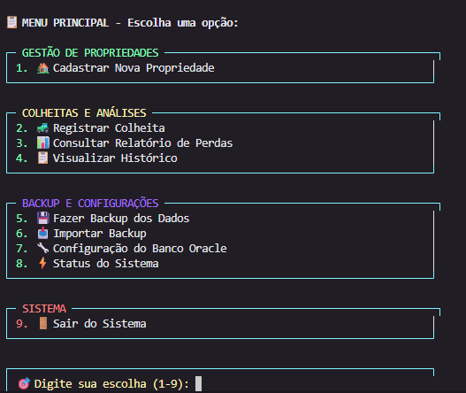
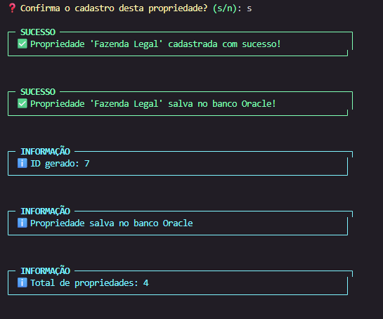
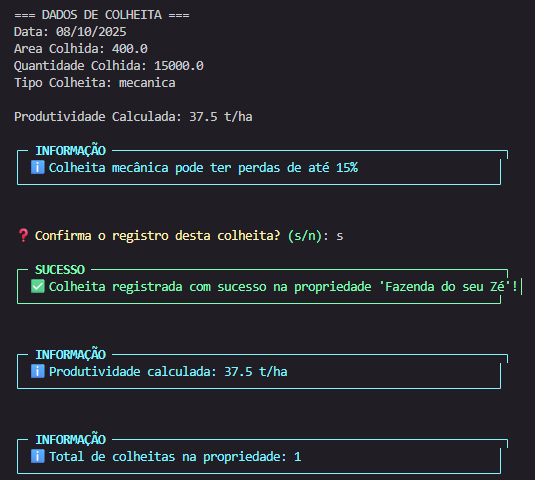
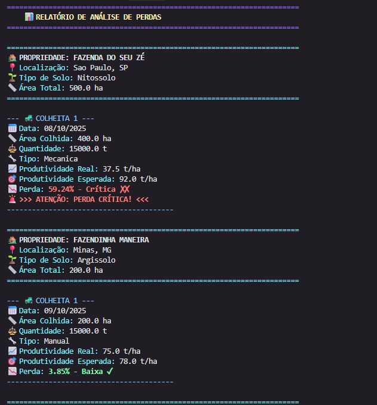
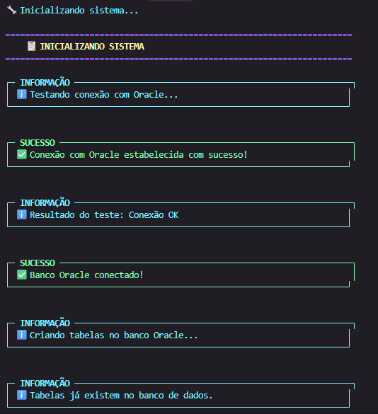
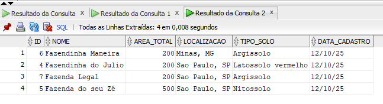
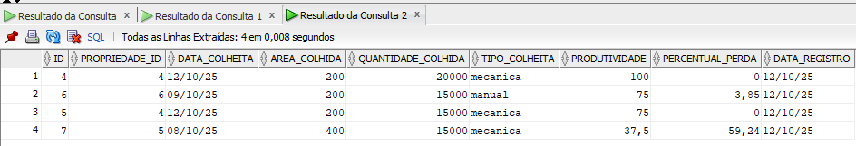
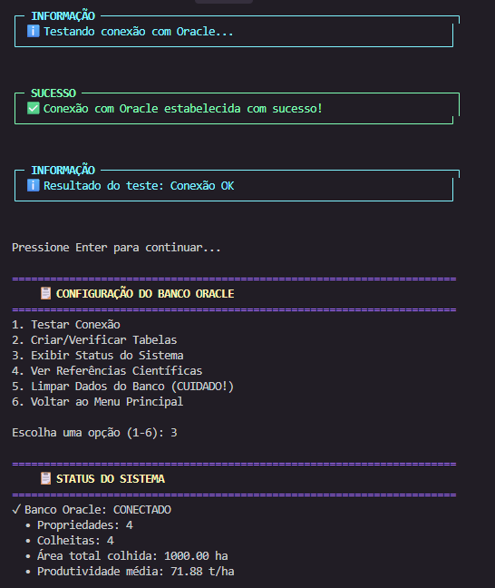

# FIAP - Faculdade de Informática e Administração Paulista

<p align="center">
<a href= "https://www.fiap.com.br/"></a>
</p>

<br>

# Sistema de Monitoramento de Perdas na Colheita de Cana-de-Açúcar

## Grupo: AgroTech Solutions

## 👨‍🎓 Integrantes: 
- <a href="https://www.linkedin.com/in/gabriel-oliveira-b6353a16b/">Gabriel Oliveira dos Santos</a>
- <a href="https://www.linkedin.com/company/inova-fusca">Roberson Pedrosa de Oliveira Junior</a>
- <a href="https://www.linkedin.com/in/arthur-bruttel-7171b8381">Arthur Bruttel Nascimento</a> 
- <a href="https://www.linkedin.com/company/inova-fusca">Jonatan Viotti Rodrigues da Silva</a> 
- <a href="https://www.linkedin.com/company/inova-fusca">Samuel Nicolas Oliveira Rocha</a>

## 👩‍🏫 Professores:
### Tutor(a) 
- <a href="https://www.linkedin.com/company/inova-fusca">Sabrina Otoni</a>
### Coordenador(a)
- <a href="https://www.linkedin.com/company/inova-fusca">Nome do Coordenador</a>

## 📜 Descrição

Este sistema foi desenvolvido como trabalho acadêmico para ajudar produtores rurais a monitorar e analisar perdas na colheita de cana-de-açúcar. O Brasil é líder mundial na produção de cana-de-açúcar, mas enfrenta perdas significativas durante a colheita que podem chegar a 15% da produção quando realizada mecanicamente.

As perdas na colheita de cana-de-açúcar representam prejuízos de aproximadamente R$ 20 milhões anuais só no estado de São Paulo. Este sistema visa registrar dados de propriedades rurais e colheitas, calcular perdas e produtividade, comparar eficiência entre colheita manual e mecânica, gerar relatórios para tomada de decisão e manter histórico de dados para análise de tendências.

O projeto implementa conceitos avançados de programação em Python, incluindo subalgoritmos, estruturas de dados (listas, tuplas, dicionários), manipulação de arquivos JSON, integração com banco de dados Oracle e interface de linha de comando com validação inteligente de dados.

## 📁 Estrutura de pastas

Dentre os arquivos e pastas presentes na raiz do projeto, definem-se:

- <b>assets</b>: aqui estão os arquivos relacionados a elementos não-estruturados deste repositório, como imagens e screenshots da aplicação.

- <b>config</b>: Arquivos de configuração do banco de dados Oracle e parâmetros do sistema.

- <b>data</b>: Arquivos de dados e backups em formato JSON para persistência local.

- <b>models</b>: Classes do sistema representando as entidades principais (Propriedade e Colheita).

- <b>services</b>: Serviços e lógica de negócio, incluindo conexão com banco Oracle, manipulação de arquivos, cálculos de perdas e validações.

- <b>utils</b>: Utilitários para validação de dados e interface do usuário com menus coloridos.

- <b>main.py</b>: Arquivo principal com o menu interativo do sistema.

- <b>README.md</b>: arquivo que serve como guia e explicação geral sobre o projeto (o mesmo que você está lendo agora).

## 🔧 Como executar o código

### Pré-requisitos

**Software Necessário:**
- Python 3.8 ou superior
- Oracle Database (ou Oracle XE para desenvolvimento)
- Oracle Instant Client (para cx_Oracle)

**Bibliotecas Python:**
- cx_Oracle (conectividade com Oracle)
- colorama (interface colorida)
- python-dotenv (variáveis de ambiente)

### Instalação

**Passo 1: Clonar o repositório**
```bash
git clone <url-do-repositorio>
cd smpc
```

**Passo 2: Criar ambiente virtual (recomendado)**
```bash
python -m venv venv
source venv/bin/activate  # Linux/Mac
# ou
venv\Scripts\activate     # Windows
```

**Passo 3: Instalar dependências**
```bash
pip install cx_Oracle colorama python-dotenv
```

**Passo 4: Configurar Oracle Instant Client**
- Baixar de: https://www.oracle.com/database/technologies/instant-client/downloads.html
- Extrair e configurar PATH do sistema

**Passo 5: Configurar variáveis de ambiente**

Criar arquivo `.env` na raiz do projeto:
```env
ORACLE_HOST=localhost
ORACLE_PORT=1521
ORACLE_SERVICE=ORCL
ORACLE_USER=seu_usuario
ORACLE_PASSWORD=sua_senha
ORACLE_CLIENT_PATH=C:\oracle\instantclient_21_3
```

### Execução

**Executar o sistema:**
```bash
python main.py
```

**Funcionalidades disponíveis:**
1. Cadastrar Nova Propriedade
2. Registrar Colheita
3. Consultar Relatório de Perdas
4. Visualizar Histórico
5. Fazer Backup dos Dados
6. Importar Backup
7. Configuração do Banco Oracle
8. Status do Sistema
9. Sair

### Exemplo de Uso

**Cadastrando uma Propriedade:**
```
Nome da propriedade: Fazenda São João
Área total (hectares): 500.0
Localização: Ribeirão Preto, SP
Tipo de solo: Latossolo Vermelho
```

**Registrando uma Colheita:**
```
Propriedade: Fazenda São João
Data da colheita: 15/01/2024
Área colhida (hectares): 50.0
Quantidade colhida (toneladas): 4500.0
Tipo de colheita: mecanica
```

### Funcionalidades Implementadas

- ✅ Cadastro de propriedades rurais
- ✅ Registro de dados de colheita
- ✅ Cálculo automático de perdas e produtividade
- ✅ Relatórios de análise com classificação de perdas
- ✅ Backup e restauração de dados em JSON
- ✅ Armazenamento em banco de dados Oracle
- ✅ Interface de linha de comando amigável com cores
- ✅ Validação inteligente de dados de entrada
- ✅ Alertas para produtividades suspeitas

## Screenshots da Aplicação

### Menu Principal

*Interface principal do sistema com menu organizado por categorias*

### Cadastro de Propriedade

*Tela de cadastro de nova propriedade rural*

### Registro de Colheita

*Interface para registrar dados de colheita com validação inteligente*

### Relatório de Perdas

*Relatório detalhado de análise de perdas com classificações*

### Mensagens do Sistema

*Mensagens coloridas de sucesso, erro e informação*

## Banco de Dados Oracle

### Dados de Propriedades

*Visualização dos dados de propriedades armazenados no banco*

### Dados de Colheitas

*Registros de colheitas com percentuais de perda calculados*

### Conexão com Oracle

*Tela de configuração e teste de conexão com banco Oracle*

## 🗃 Histórico de lançamentos

* 0.5.0 - 12/10/2025
    * Implementação completa do sistema com banco Oracle
    * Interface colorida e validação inteligente
    * Cálculos científicos de perdas baseados em pesquisas EMBRAPA
    * Adicionando estilo nos prompts do terminal e README
* 0.4.0 - 07/10/2025
    * Integração com banco de dados Oracle
    * Sistema de backup e restauração JSON
    * Relatórios avançados de análise de perdas
    * Fix da exibição e escolha de tipo de solo
* 0.3.0 - 04/10/2025
    * Implementação de cálculos de produtividade
    * Validação de dados de entrada
    * Sistema de classificação de perdas
    * Integração completa com banco de dados
* 0.2.0 - 28/09/2025
    * Criação das classes Propriedade e Colheita
    * Implementação de serviços básicos
    * Menu interativo inicial
    * Adicionando menu e validações
* 0.1.0 - 27/092025
    * Estrutura inicial do projeto
    * Definição de requisitos e arquitetura

## 📋 Licença

<p xmlns:cc="http://creativecommons.org/ns#" xmlns:dct="http://purl.org/dc/terms/"><a property="dct:title" rel="cc:attributionURL" href="https://github.com/agodoi/template">MODELO GIT FIAP</a> por <a rel="cc:attributionURL dct:creator" property="cc:attributionName" href="https://fiap.com.br">Fiap</a> está licenciado sobre <a href="http://creativecommons.org/licenses/by/4.0/?ref=chooser-v1" target="_blank" rel="license noopener noreferrer" style="display:inline-block;">Attribution 4.0 International</a>.</p>

---

**📊 Sistema de Monitoramento de Perdas na Colheita de Cana-de-Açúcar**  
*Tecnologia a serviço da agricultura brasileira* 🌾