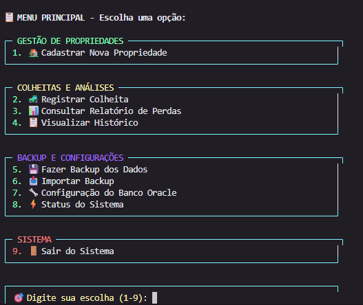
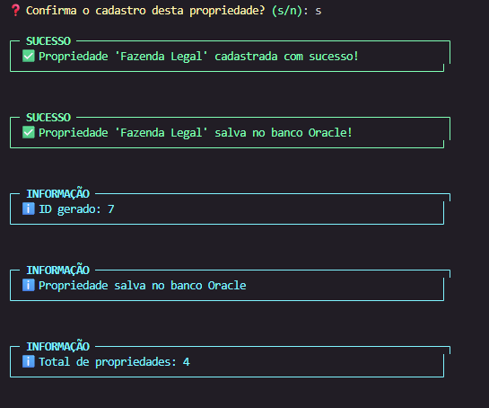
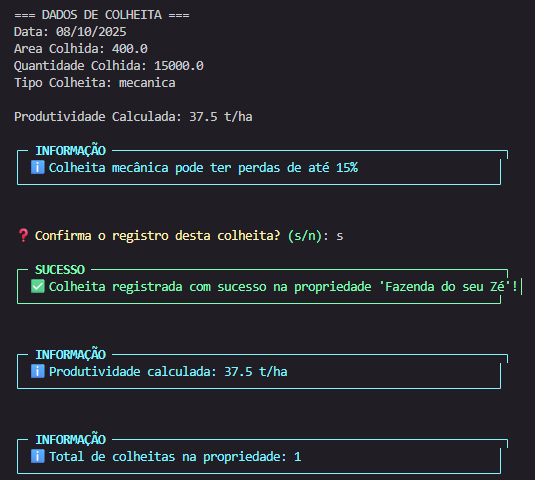
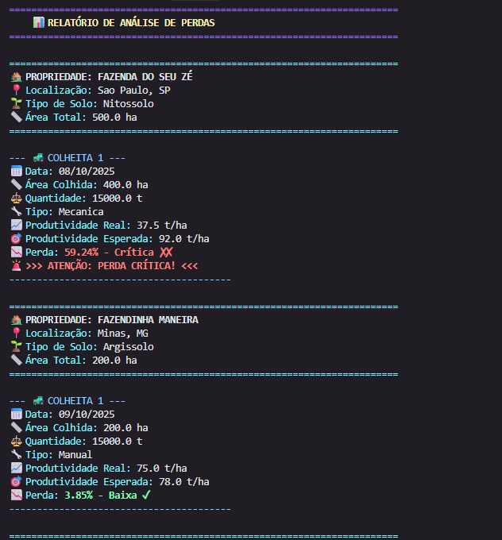
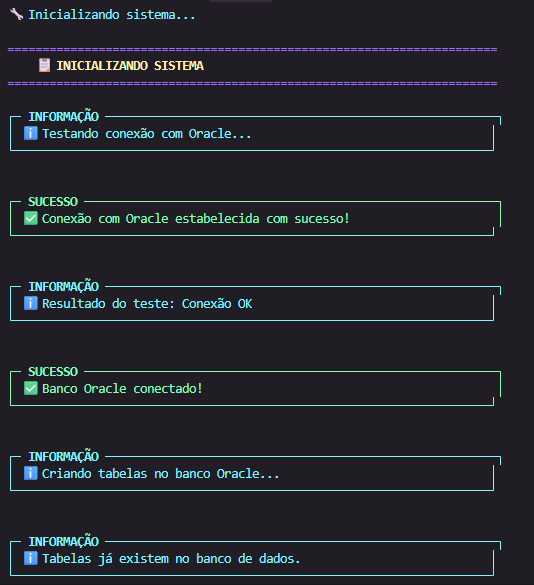
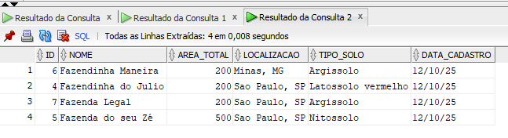
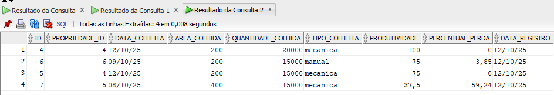
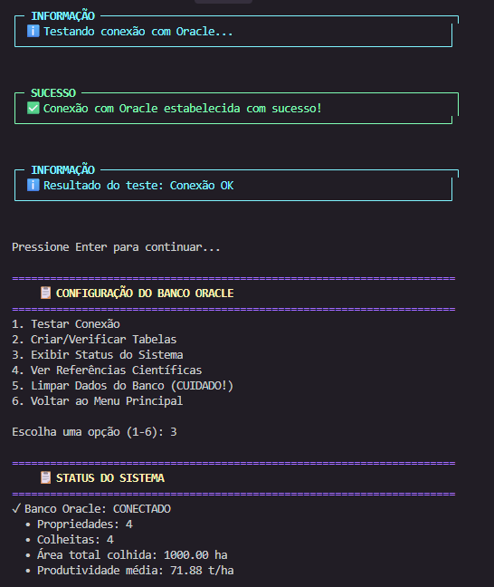

# Sistema de Monitoramento de Perdas na Colheita de Cana-de-Açúcar

## Descrição do Projeto

Este sistema foi desenvolvido como trabalho acadêmico para ajudar produtores rurais a monitorar e analisar perdas na colheita de cana-de-açúcar. O Brasil é líder mundial na produção de cana-de-açúcar, mas enfrenta perdas significativas durante a colheita que podem chegar a 15% da produção quando realizada mecanicamente.

## Problema Abordado

As perdas na colheita de cana-de-açúcar representam prejuízos de aproximadamente R$ 20 milhões anuais só no estado de São Paulo. Este sistema visa:

- Registrar dados de propriedades rurais e colheitas
- Calcular perdas e produtividade
- Comparar eficiência entre colheita manual e mecânica
- Gerar relatórios para tomada de decisão
- Manter histórico de dados para análise de tendências

## Funcionalidades

- ✅ Cadastro de propriedades rurais
- ✅ Registro de dados de colheita
- ✅ Cálculo automático de perdas e produtividade
- ✅ Relatórios de análise
- ✅ Backup e restauração de dados em JSON
- ✅ Armazenamento em banco de dados Oracle
- ✅ Interface de linha de comando amigável com cores
- ✅ Validação inteligente de dados de entrada
- ✅ Alertas para produtividades suspeitas

## Conceitos Técnicos Utilizados

Este projeto implementa os seguintes conceitos de programação em Python:

### Subalgoritmos
- Funções para validação de dados
- Procedimentos para cálculos de perdas
- Funções com passagem de parâmetros

### Estruturas de Dados
- **Listas**: Armazenamento de propriedades e colheitas
- **Tuplas**: Coordenadas e retorno de múltiplos valores
- **Dicionários**: Mapeamento de dados e configurações
- **Tabelas de Memória**: Representação de dados do banco

### Manipulação de Arquivos
- **Arquivos JSON**: Backup e restauração de dados
- **Arquivos de Texto**: Logs e configurações

### Banco de Dados
- **Oracle**: Armazenamento persistente de dados
- **Operações CRUD**: Create, Read, Update, Delete
- **Consultas SQL**: Relatórios e análises

## Estrutura do Projeto

```
sistema_cana/
├── main.py                 # Arquivo principal com menu
├── models/                 # Classes do sistema
│   ├── propriedade.py     # Classe Propriedade
│   └── colheita.py        # Classe Colheita
├── services/              # Serviços e lógica de negócio
│   ├── database_service.py # Conexão e operações Oracle
│   ├── file_service.py    # Manipulação de arquivos JSON
│   ├── calculation_service.py # Cálculos de perdas
│   ├── propriedade_service.py # Serviços de propriedade
│   └── colheita_service.py # Serviços de colheita
├── utils/                 # Utilitários
│   ├── validation.py      # Validação de dados
│   └── menu_utils.py      # Utilitários do menu
├── data/                  # Arquivos de dados
│   └── backup_colheitas.json # Arquivo de backup
├── config/                # Configurações
│   └── database_config.py # Configurações do banco
└── README.md              # Este arquivo
```

## Tecnologias Utilizadas

### Backend
- **Python 3.8+** - Linguagem principal
- **cx_Oracle** - Conectividade com Oracle Database
- **colorama** - Interface colorida no terminal
- **dotenv** - Gerenciamento de variáveis de ambiente
- **json** - Manipulação de arquivos de backup
- **re** - Expressões regulares para validação

### Banco de Dados
- **Oracle Database** - Armazenamento principal
- **SQL** - Linguagem de consulta
- **Sequences** - Auto-incremento de IDs
- **Foreign Keys** - Integridade referencial

### Interface
- **CLI (Command Line Interface)** - Interface de linha de comando
- **Menus interativos** - Navegação intuitiva
- **Validação em tempo real** - Verificação de dados
- **Mensagens coloridas** - Feedback visual

## Requisitos Técnicos

### Software Necessário
- Python 3.8 ou superior
- Oracle Database (ou Oracle XE para desenvolvimento)
- Oracle Instant Client (para cx_Oracle)

### Instalação das Dependências

```bash
# Criar ambiente virtual (recomendado)
python -m venv venv
source venv/bin/activate  # Linux/Mac
# ou
venv\Scripts\activate     # Windows

# Instalar dependências
pip install cx_Oracle colorama python-dotenv

# Configurar Oracle Instant Client
# Baixar de: https://www.oracle.com/database/technologies/instant-client/downloads.html
```

### Configuração do Ambiente

1. **Arquivo .env** (criar na raiz do projeto):
```env
ORACLE_HOST=localhost
ORACLE_PORT=1521
ORACLE_SERVICE=ORCL
ORACLE_USER=seu_usuario
ORACLE_PASSWORD=sua_senha
ORACLE_CLIENT_PATH=C:\oracle\instantclient_21_3
```

2. **Teste de Conexão**:
```bash
python -c "import cx_Oracle; print('cx_Oracle instalado com sucesso!')"
```

## Screenshots da Aplicação

### Menu Principal

*Interface principal do sistema com menu organizado por categorias*

### Cadastro de Propriedade

*Tela de cadastro de nova propriedade rural*

### Registro de Colheita

*Interface para registrar dados de colheita com validação inteligente*

### Relatório de Perdas

*Relatório detalhado de análise de perdas com classificações*

### Mensagens do Sistema

*Mensagens coloridas de sucesso, erro e informação*

## Banco de Dados Oracle

### Dados de Propriedades

*Visualização dos dados de propriedades armazenados no banco*

### Dados de Colheitas

*Registros de colheitas com percentuais de perda calculados*

### Conexão com Oracle

*Tela de configuração e teste de conexão com banco Oracle*

## Como Usar

### 1. Executando o Sistema

```bash
cd sistema_cana
python main.py
```

### 3. Configuração do Banco Oracle (Opcional)

Para usar banco Oracle em produção:
1. Configure as credenciais no arquivo `.env`
2. Execute o sistema e use a opção de criar tabelas

### 3. Menu Principal

O sistema apresentará um menu com as seguintes opções:

1. **Cadastrar Nova Propriedade** - Registra uma nova propriedade rural
2. **Registrar Colheita** - Adiciona dados de uma colheita realizada
3. **Consultar Relatório de Perdas** - Visualiza análises de perdas
4. **Visualizar Histórico** - Consulta dados históricos
5. **Fazer Backup dos Dados** - Exporta dados para JSON
6. **Importar Backup** - Restaura dados de arquivo JSON
7. Configuração do Banco Oracle - Exibe configurações do Banco (Criar/Verificar Tabelas, exibir status do sistema, etc.)
8. Status do Sistema
9. **Sair** - Encerra o sistema

## Exemplos de Uso

### Cadastrando uma Propriedade
```
Nome da propriedade: Fazenda São João
Área total (hectares): 500.0
Localização: Ribeirão Preto, SP
Tipo de solo: Latossolo Vermelho
```

### Registrando uma Colheita
```
Propriedade: Fazenda São João
Data da colheita: 15/01/2024
Área colhida (hectares): 50.0
Quantidade colhida (toneladas): 4500.0
Tipo de colheita: mecanica
```

## Cálculos Realizados

### Produtividade
```
Produtividade = Quantidade Colhida ÷ Área Colhida
```

### Percentual de Perda
```
% Perda = ((Produtividade Esperada - Produtividade Real) ÷ Produtividade Esperada) × 100
```

### Classificação de Perdas
- **Baixa**: 0-5%
- **Média**: 5-10%
- **Alta**: 10-15%
- **Crítica**: >15%

## Dados de Referência

### Produtividade Esperada por Tipo de Solo
- Latossolo Vermelho: 100 t/ha
- Argissolo: 85 t/ha
- Neossolo: 75 t/ha
- Outros: 80 t/ha

## Estrutura do Banco de Dados

### Tabela PROPRIEDADES
| Campo         | Tipo          | Descrição                        |
| ------------- | ------------- | -------------------------------- |
| id            | NUMBER        | Chave primária (auto-incremento) |
| nome          | VARCHAR2(100) | Nome da propriedade              |
| area_total    | NUMBER(10,2)  | Área total em hectares           |
| localizacao   | VARCHAR2(200) | Localização da propriedade       |
| tipo_solo     | VARCHAR2(50)  | Tipo de solo                     |
| data_cadastro | DATE          | Data de cadastro (automática)    |

### Tabela COLHEITAS
| Campo              | Tipo         | Descrição                        |
| ------------------ | ------------ | -------------------------------- |
| id                 | NUMBER       | Chave primária (auto-incremento) |
| propriedade_id     | NUMBER       | FK para PROPRIEDADES             |
| data_colheita      | DATE         | Data da colheita                 |
| area_colhida       | NUMBER(10,2) | Área colhida em hectares         |
| quantidade_colhida | NUMBER(10,2) | Quantidade em toneladas          |
| tipo_colheita      | VARCHAR2(20) | 'manual' ou 'mecanica'           |
| produtividade      | NUMBER(10,2) | Produtividade calculada (t/ha)   |
| percentual_perda   | NUMBER(5,2)  | Percentual de perda calculado    |
| data_registro      | DATE         | Data de registro (automática)    |

## Funcionalidades Avançadas

### Validação Inteligente
- Detecta produtividades suspeitas (< 30 t/ha ou > 150 t/ha)
- Sugere correções baseadas em valores típicos
- Confirma dados antes de salvar no banco

### Cálculos Científicos
- Produtividades esperadas baseadas em pesquisas da EMBRAPA
- Classificação de perdas conforme padrões da indústria
- Comparação entre colheita manual vs mecânica

### Interface Amigável
- Menus organizados por categoria
- Cores para diferentes tipos de mensagem
- Feedback visual em tempo real
- Navegação intuitiva

## Troubleshooting

### Problemas Comuns

#### Erro de Conexão com Oracle
```
ORA-12541: TNS:no listener
```
**Solução**: Verifique se o Oracle Database está rodando e as configurações de host/porta estão corretas.

#### Erro cx_Oracle não encontrado
```
ModuleNotFoundError: No module named 'cx_Oracle'
```
**Solução**: 
```bash
pip install cx_Oracle
# Certifique-se de que o Oracle Instant Client está instalado
```

#### Produtividade Suspeita
```
⚠️ ATENÇÃO: Produtividade muito baixa (1.0 t/ha)
```
**Solução**: Verifique se:
- A área está em HECTARES (não metros²)
- A quantidade está em TONELADAS (não kg)
- Os valores foram digitados corretamente

#### Erro de Validação de Data
```
Data deve estar no formato DD/MM/AAAA
```
**Solução**: Use o formato correto, ex: `15/01/2024`

### Suporte

Para problemas técnicos:
1. Verifique a seção de troubleshooting
2. Consulte a documentação do Oracle
3. Verifique os logs de erro
4. Teste com dados de exemplo

## Performance

### Otimizações Implementadas
- Conexões de banco otimizadas
- Validação de dados em tempo real
- Cálculos eficientes de produtividade
- Interface responsiva

## Licença

Este projeto é para fins acadêmicos e educacionais.

### Referências Científicas
- EMBRAPA Solos - Dados de produtividade por tipo de solo
- UNICA (União da Indústria de Cana-de-Açúcar) - Estatísticas do setor
- IAC (Instituto Agronômico de Campinas) - Pesquisas em cana-de-açúcar

---

**📊 Sistema de Monitoramento de Perdas na Colheita de Cana-de-Açúcar**  
*Tecnologia a serviço da agricultura brasileira* 🌾